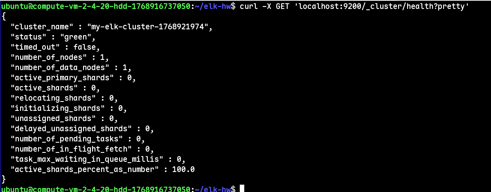
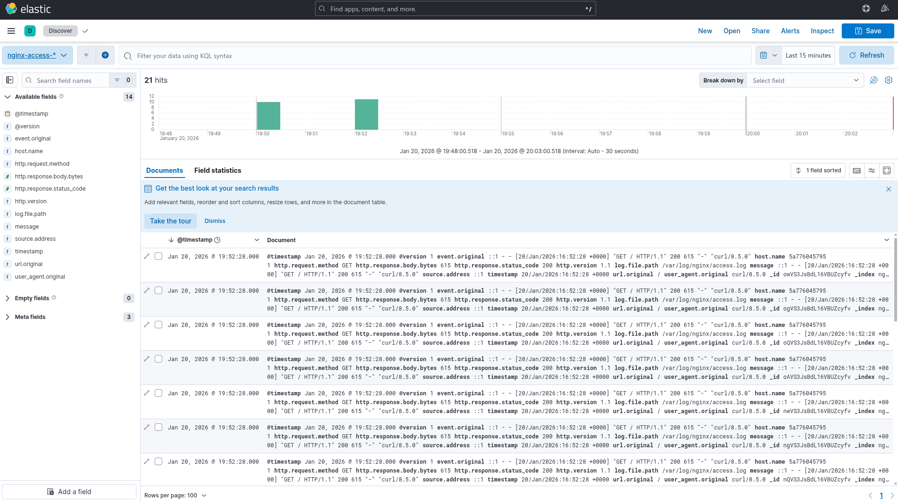
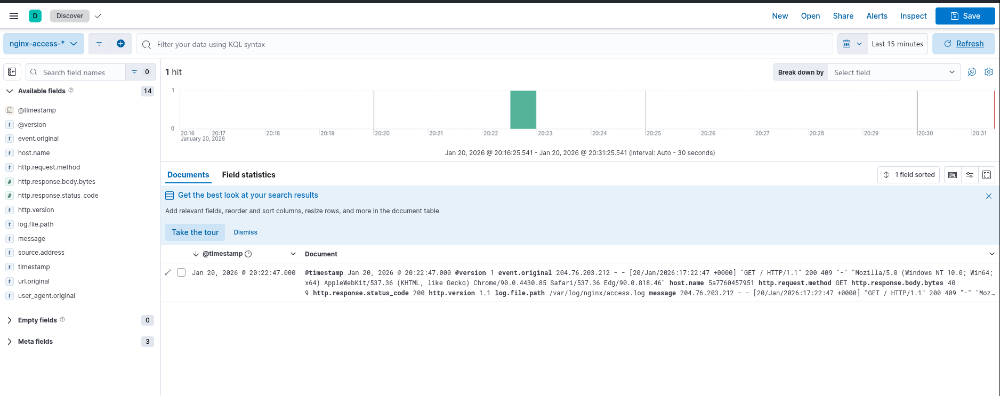

# Домашнее задание к занятию «ELK»  **Шаров Олег**

---

## Задание 1

Установите и запустите Elasticsearch, после чего поменяйте параметр `cluster_name` на случайный.  
Приведите скриншот команды `curl -X GET 'localhost:9200/_cluster/health?pretty'`, сделанной на сервере с установленным Elasticsearch, где будет виден нестандартный `cluster_name`.

**Решение:**

Elasticsearch запущен в Docker-контейнере с помощью следующей команды:

```bash
docker run -d \
  --name elasticsearch \
  -p 9200:9200 \
  -e "discovery.type=single-node" \
  -e "cluster.name=my-elk-cluster-$(date +%s)" \
  -e "xpack.security.enabled=false" \
  -e "ES_JAVA_OPTS=-Xms1g -Xmx1g" \
  -v esdata:/usr/share/elasticsearch/data \
  --ulimit memlock=-1:-1 \
  docker.elastic.co/elasticsearch/elasticsearch:8.12.0
```

После успешного запуска выполнена команда проверки состояния кластера:
```bash
curl -X GET 'localhost:9200/_cluster/health?pretty'
```




## Задание 2

Установите и запустите Kibana.  
Приведите скриншот интерфейса Kibana на странице `http://<ip вашего сервера>:5601/app/dev_tools#/console`, где будет выполнен запрос `GET /_cluster/health?pretty`.

**Решение:**

Kibana была запущена в Docker-контейнере с использованием host-сети для прямого доступа к Elasticsearch, работающему на том же хосте:

```bash
docker run -d \
  --name kibana \
  --network host \
  -e ELASTICSEARCH_HOSTS="http://localhost:9200" \
  docker.elastic.co/kibana/kibana:8.12.0
```
В браузере перешёл по адресу:
>http://158.160.221.234:5601/app/dev_tools#/console

В консоли Dev Tools выполнил запрос:

```bash
GET /_cluster/health?pretty
```

На скриншоте ниже виден результат выполнения запроса — в частности, нестандартное значение `cluster_name`, подтверждающее корректную работу связки Kibana + Elasticsearch.


## Задание 3

Установите и запустите Logstash и Nginx. С помощью Logstash отправьте access-лог Nginx в Elasticsearch.  
Приведите скриншот интерфейса Kibana, на котором видны логи Nginx.

**Решение:**

Установлен Nginx и сгенерирован тестовый трафик:
```bash
for i in {1..10}; do curl -s http://localhost > /dev/null; done
```

Logstash настроен на чтение /var/log/nginx/access.log и отправку в Elasticsearch через конфигурацию:

```conf
input {
  file {
    path => "/var/log/nginx/access.log"
    start_position => "beginning"
    sincedb_path => "/dev/null"
  }
}
filter {
  grok {
    match => { "message" => "%{COMBINEDAPACHELOG}" }
  }
  date {
    match => [ "timestamp", "dd/MMM/yyyy:HH:mm:ss Z" ]
    target => "@timestamp"
  }
}
output {
  elasticsearch {
    hosts => ["http://host.docker.internal:9200"]
    index => "nginx-access-%{+YYYY.MM.dd}"
  }
}
```

Запущен в Docker:

```bash
docker run -d --name logstash --add-host=host.docker.internal:host-gateway ...
```

Данные успешно попали в Elasticsearch (индекс nginx-access-2026.01.20 создан).

В Kibana создан Data View nginx-access-* и открыта вкладка Discover.

Результат:




## Задание 4

Установите и запустите Filebeat. Переключите поставку логов Nginx с Logstash на Filebeat.  
Приведите скриншот интерфейса Kibana, на котором видны логи Nginx, которые были отправлены через Filebeat.

**Решение:**

Filebeat был установлен и настроен на чтение access-лога Nginx (`/var/log/nginx/access.log`) с отправкой напрямую в Elasticsearch.

Конфигурационный файл `filebeat.yml`:

```yaml
filebeat.inputs:
- type: filestream
  enabled: true
  paths:
    - /var/log/nginx/access.log

setup.kibana:
  host: "http://84.252.135.204:5601"

output.elasticsearch:
  hosts: ["http://84.252.135.204:9200"]
```

Filebeat запущен в Docker-контейнере:
```bash
docker run -d \
  --name filebeat \
  --user=root \
  -v $(pwd)/filebeat.yml:/usr/share/filebeat/filebeat.yml:ro \
  -v /var/log/nginx:/var/log/nginx:ro \
  docker.elastic.co/beats/filebeat:8.12.0 \
  filebeat -e -strict.perms=false
```

Сгенерирован тестовый трафик к Nginx:
```bash
for i in {1..10}; do curl -s http://localhost > /dev/null; done
```

В Kibana создан Data View filebeat-*  и открыта вкладка Discover.

На скриншоте ниже видны логи Nginx, отправленные через Filebeat: распарсены метод запроса `(GET)`, статус ответа (`200`), IP-адрес клиента и другие поля.




